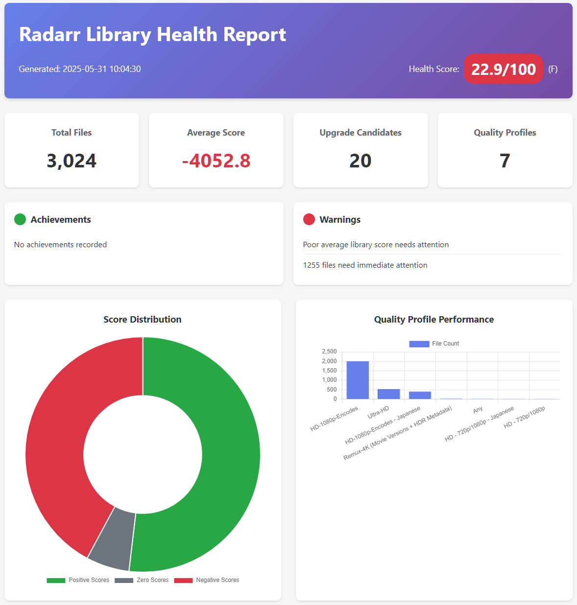
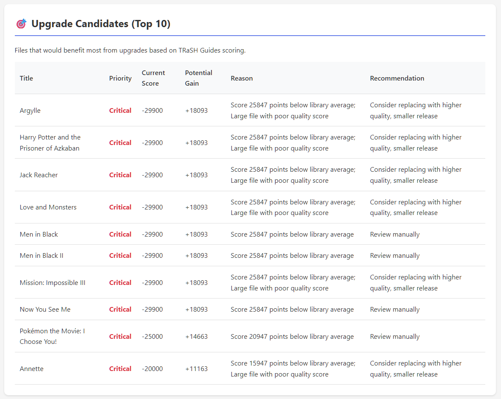
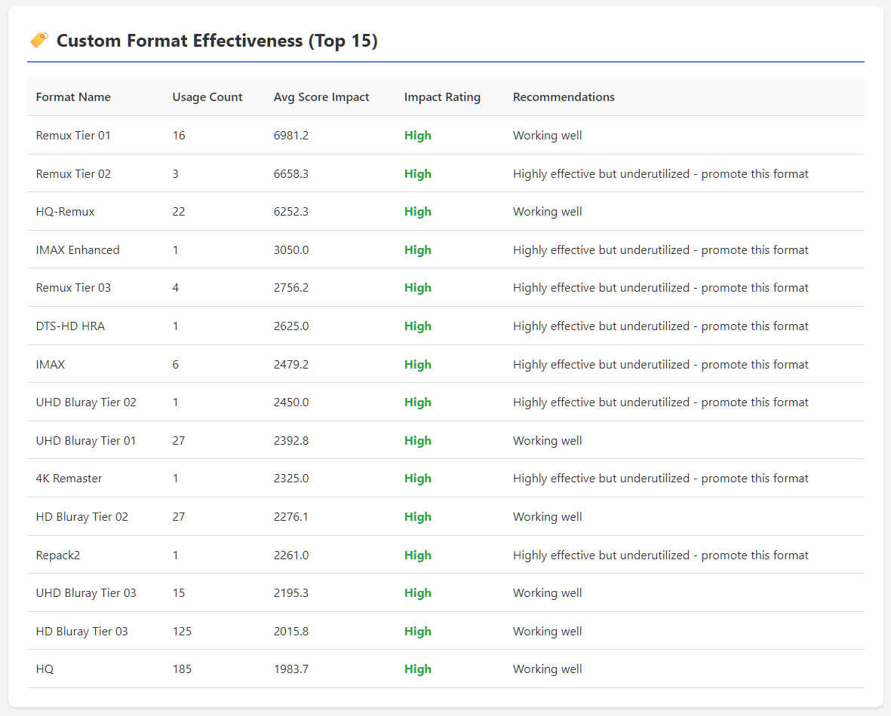

# *Arr Custom Format Score Exporter


Extracts TRaSH Guides custom format scores from Radarr/Sonarr and generates interactive dashboards with upgrade recommendations.



## Features

- **Export & Analysis**: Extract scores from Radarr/Sonarr with upgrade candidate detection
- **Interactive Dashboards**: HTML reports with charts showing library health and recommendations
- **File Size Analysis**: Visual scatter plots showing file size vs score correlations
- **Historical Tracking**: Monitor score changes and improvements over time
- **CSV/JSON Export**: Multiple output formats for further analysis

## Quick Start

```bash
# Install
git clone https://github.com/gdadkins/arr-score-exporter.git
cd arr-score-exporter
pip install -e .

# Configure
cp config.yaml.example config.yaml
# Edit config.yaml with your URLs and API keys

# Test and run
arr-export-enhanced validate-config                # Test API connections
arr-export-enhanced radarr                         # Collect data + CSV export
arr-export-enhanced report --service radarr        # Generate HTML dashboard
```

## Requirements

- Python 3.8+
- Radarr v4+ and/or Sonarr v3+ with API access
- TRaSH Guides custom formats configured

## Installation

```bash
git clone https://github.com/gdadkins/arr-score-exporter.git
cd arr-score-exporter
pip install -e .

# Optional: Virtual environment
python -m venv venv
source venv/bin/activate  # Linux/macOS
venv\Scripts\activate     # Windows
pip install -e .
```

## Configuration

1. **Copy config file**: `cp config.yaml.example config.yaml`

2. **Edit config.yaml**:
   ```yaml
   radarr:
     url: "http://your-radarr:7878"
     api_key: "your_api_key"
     enabled: true
   
   sonarr:
     url: "http://your-sonarr:8989" 
     api_key: "your_api_key"
     enabled: true
   ```

3. **Get API keys**: Settings → General → Security → API Key

4. **Test**: `arr-export test-config`

## Usage

### CSV Export (Basic)
```bash
# Test configuration
arr-export test-config

# CSV export only
arr-export radarr
arr-export sonarr
arr-export both

# Options
arr-export --verbose radarr              # Detailed output
arr-export --config custom.yaml radarr    # Custom config
arr-export --output-dir exports radarr    # Custom output
```

### Interactive Dashboards (Enhanced)
```bash
# HTML dashboards with analysis
arr-export-enhanced report --service radarr
arr-export-enhanced report --service sonarr
arr-export-enhanced report --service both
```

### Output Files
- **arr-export**: `radarr_export_YYYYMMDD.csv` - CSV data only
- **arr-export-enhanced**: `radarr_dashboard_YYYYMMDD.html` - Interactive HTML dashboard + CSV

### Legacy Scripts
Simple scripts available in `legacy/` folder:
```bash
python legacy/export_radarr_scores.py
python legacy/export_sonarr_scores.py
```

## Output

### Dashboard (HTML)
- Library overview with health score
- Upgrade candidates list
- Custom format effectiveness
- Historical trends




### CSV Export
```csv
Title,File,Total_Score,Quality_Profile,Codec,Resolution,Custom_Formats
"The Matrix","Matrix.2160p.mkv",6150,"4K Remux","x265","2160p","Remux Tier 01|HDR10+"
```

### Database
- SQLite storage at `~/.arr-score-exporter/library.db`
- Historical tracking and trends

## Performance Tuning

```yaml
export:
  max_workers: 5          # Parallel API calls
  retry_attempts: 3       # Retry count
  timeout: 30             # Request timeout
```

**Large libraries (5000+ files)**:
- Reduce `max_workers` to 3
- Increase `timeout` to 60
- Requires 4GB+ RAM

## Troubleshooting

```bash
# Test configuration
arr-export test-config

# Detailed logging
arr-export --verbose radarr

# Common issues
# Connection refused - Check URL/API key
# Database locked - Fixed in v2.0
# High memory - Reduce max_workers
```

See [docs/TROUBLESHOOTING.md](docs/TROUBLESHOOTING.md) for detailed solutions.

## Documentation

- [**Usage Guide**](USAGE-GUIDE.md) - Examples and workflows
- [**API Reference**](docs/API_REFERENCE.md) - CLI commands and Python API  
- [**Troubleshooting**](docs/TROUBLESHOOTING.md) - Common issues and solutions
- [**Architecture**](docs/ARCHITECTURE.md) - Technical design
- [**Development**](docs/development_docs.md) - Contributing guide

## Development

```bash
# Development setup
pip install -e .[dev]
pytest                    # Run tests
black . && isort .        # Code formatting
mypy src/                 # Type checking
```

## Recent Updates (v2.0)

### ✅ CRITICAL FIX: HTML Reports Fully Restored
**All interactive functionality has been restored** after addressing JavaScript dependency issues:
- **Charts Working**: Score distribution, format effectiveness, file size analysis with proper color coding
- **Export Functions**: CSV, Excel, PDF export buttons fully operational
- **Interactive Tables**: Pagination, search, sorting for upgrade candidates
- **Tooltips & UI**: Bootstrap 5 integration with responsive design

### Core Features
- Interactive HTML dashboards with Chart.js
- Intelligent upgrade candidate detection
- SQLite database with historical tracking
- Enhanced CLI with progress bars
- Fixed database locking issues
- Multi-threaded processing with rate limiting

Legacy scripts remain available in `legacy/` folder.

## Contributing

```bash
git fork https://github.com/gdadkins/arr-score-exporter
pip install -e .[dev]
# Make changes, test, submit PR
```

See [docs/development_docs.md](docs/development_docs.md) for guidelines.

## License

[MIT License](LICENSE)

## Acknowledgments

- [TRaSH Guides](https://trash-guides.info/) - Custom format methodology
- [Radarr](https://radarr.video/) & [Sonarr](https://sonarr.tv/) - APIs and documentation
- [Chart.js](https://chartjs.org/) - Dashboard visualizations

---

[Report Issues](https://github.com/gdadkins/arr-score-exporter/issues) • [Documentation](docs/)